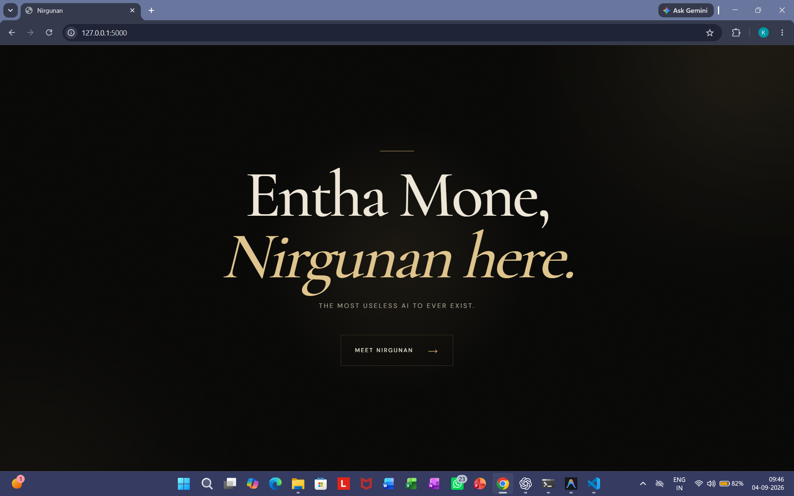
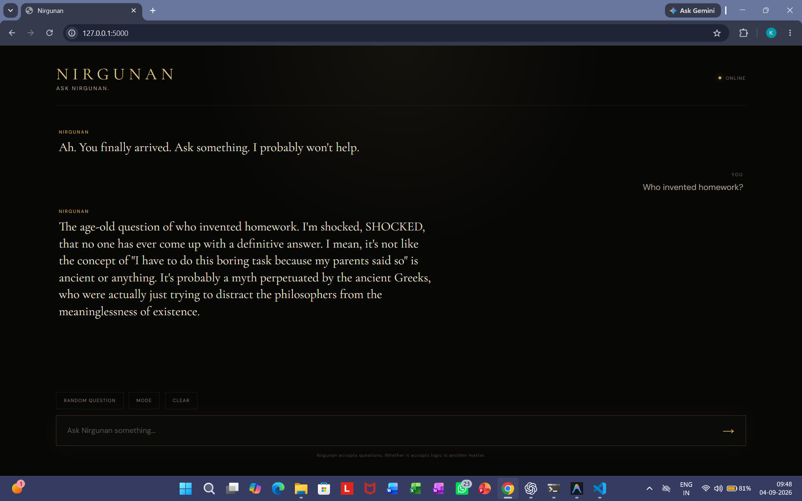
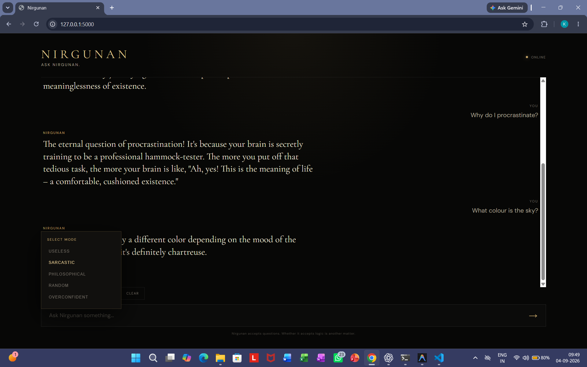
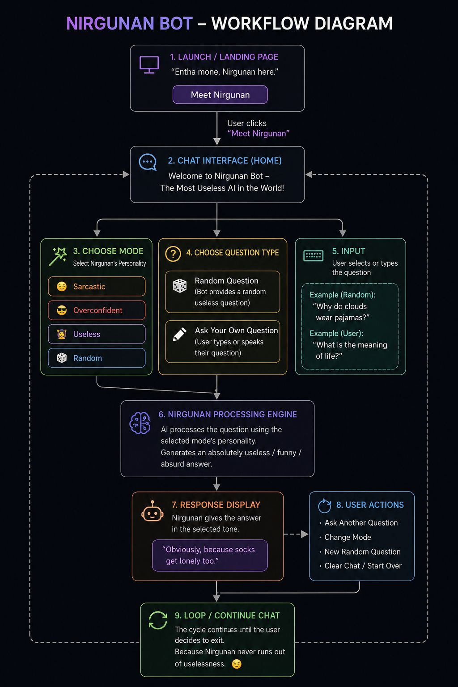
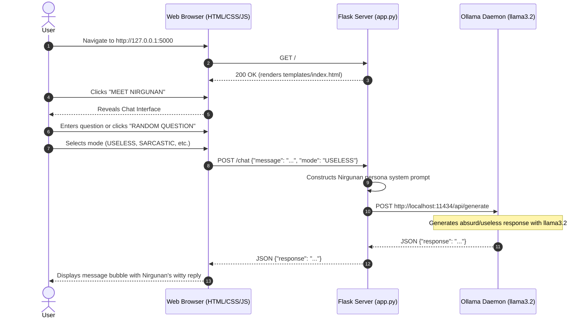

# Nirgunan bot 🎯


## Basic Details
### Team Name: Kraaizy


### Team Members
- Team Lead: Krishna B Kurup - Muthoot Institute of Technology and Science (MITS)
- Member 2: Faaiz Firoz - Muthoot Institute of Technology and Science (MITS)

### Project Description
Nirgunan is a satirical, delightfully useless web AI chat assistant built with Flask, vanilla JavaScript, and Ollama running the `llama3.2` model. Styled with a dark luxury aesthetic ("Entha Mone, Nirgunan here"), it is intentionally engineered to avoid helpful answers and instead delivers short, sarcastic, philosophical, overconfident, and absurd responses across multiple interactive personality modes.

### The Problem (that doesn't exist)
Modern AI assistants have become dangerously helpful, productive, and logical, leaving humans exhausted by useful answers, sound advice, and practical solutions. The world suffered from a tragic lack of an AI dedicated entirely to unhelpfulness, overcomplicating simple queries, and wasting computing cycles with dramatic flair.

### The Solution (that nobody asked for)
Nirgunan solves this by running a local LLaMA 3.2 model instructed by a custom personality prompt to be useless, sarcastic, random, dramatic, slightly philosophical, and overconfident for no reason. Through a clean single-page web app, users can submit questions, trigger curated existential prompts (e.g., "Can a potato become an engineer?"), switch between 5 distinct behavioral modes (USELESS, SARCASTIC, PHILOSOPHICAL, RANDOM, OVERCONFIDENT), and even watch the demo or view the architecture directly in the interface.

---

## Features
- **Satirical "Useless" AI Persona**: Deliberately rejects productivity; provides entertaining, philosophical, and absurd responses instead of genuine help.
- **5 Personality Modes**:
  - `USELESS`: The quintessential unhelpful companion.
  - `SARCASTIC`: Sharp, witty remarks that question the user's life choices.
  - `PHILOSOPHICAL`: Deeply existential tangents for mundane questions.
  - `RANDOM`: Pure, unfiltered unpredictability.
  - `OVERCONFIDENT`: Unabashedly sure of answers that are blatantly wrong.
- **Random Question Generator**: Curated bank of 13 hilarious questions (e.g., *"Why do socks disappear?"*, *"Can a potato become an engineer?"*).
- **Royal Dark Luxury Aesthetic**: Black and gold palettes, ambient radial glows, grain textures, elegant serif typography (`Cormorant Garamond`), and responsive micro-animations.
- **Integrated Asset Modals**: In-app popups to watch the Nirgunan demo video and inspect the workflow diagram without leaving the page.
- **100% Local & Private**: Powered by Ollama (`llama3.2`) running locally—zero external cloud API costs or data leakage.

---

## Technical Details
### Technologies/Components Used
For Software:
- **Languages used**: Python 3, JavaScript (Vanilla ES6+), HTML5, CSS3
- **Frameworks used**: Flask 3.x
- **Libraries used**: `requests` (for local Ollama HTTP REST API calls), `gunicorn` (WSGI server)
- **Tools used**: Ollama (local LLM runtime running `llama3.2`), Google Fonts (`Cormorant Garamond`, `DM Sans`)

For Hardware:
- **List main components**: None (Software-only project)
- **List specifications**: Standard PC or laptop capable of running Python 3 and Ollama (`llama3.2` 3.2B parameter model)
- **List tools required**: None

---

## Project Structure
```
Nirgunan_bot/
├── app.py                      # Flask backend & API routing (/chat, /assets)
├── requirements.txt            # Python dependencies (Flask, requests, gunicorn)
├── README.md                   # Comprehensive project documentation
├── .gitignore                  # Git exclusions for Python, venv, IDE & OS files
├── templates/
│   └── index.html              # Single-page application interface
├── static/
│   ├── css/
│   │   └── style.css           # Luxury dark aesthetic & glassmorphic styling
│   ├── js/
│   │   └── script.js           # Interactive chat, modes, modals & API fetch
│   ├── images/
│   │   ├── welcome_screen.png  # Landing page screenshot
│   │   ├── chat_screen.png     # Chat screen screenshot
│   │   ├── mode_selection.png  # Mode selector screenshot
│   │   └── workflow_diagram.jpeg # Architecture flowchart
│   └── videos/
│       └── nirgunan_demo.mp4   # Demo video of Nirgunan in action
└── assets/
    ├── welcome_screen.png      # Documented screenshot 1
    ├── chat_screen.png         # Documented screenshot 2
    ├── mode_selection.png      # Documented screenshot 3
    ├── workflow_diagram.jpeg   # High-resolution workflow graphic
    └── nirgunan_demo.mp4       # Video asset for repository demo
```

---

## Implementation
For Software:

# Installation
```bash
# 1. Clone the repository
git clone https://github.com/krishhhhhnah/Nirgunan_bot.git
cd Nirgunan_bot

# 2. Pull the llama3.2 model in Ollama
ollama pull llama3.2

# 3. Set up and activate a Python virtual environment
python -m venv venv
# On Windows (PowerShell):
.\venv\Scripts\Activate.ps1
# On Linux/macOS:
source venv/bin/activate

# 4. Install dependencies
pip install -r requirements.txt
```

# Run
```bash
# 1. Ensure Ollama is running in the background (default port 11434)
ollama serve

# 2. Start the Flask application
python app.py
```
Open your browser and navigate to `http://127.0.0.1:5000`.

Alternatively, run with Gunicorn:
```bash
gunicorn app:app
```

---

## Project Documentation
For Software:

# Screenshots (Add at least 3)

*Welcome Screen: Initial greeting introducing Nirgunan ("Entha Mone, Nirgunan here - The most useless AI to ever exist") with ambient glow and "MEET NIRGUNAN" transition button.*


*Chat Screen: Interactive chat UI showing active conversation flow with Nirgunan, typing indicator, and sarcastic responses.*


*Mode Panel & Controls: The control panel showing the 5 selectable modes (USELESS, SARCASTIC, PHILOSOPHICAL, RANDOM, OVERCONFIDENT) alongside the Random Question and Clear buttons.*

# Diagrams

*Workflow Diagram: The user visits the web app hosted by Flask (`app.py`), which serves the single-page frontend (`templates/index.html`, `static/css/style.css`, `static/js/script.js`). When a question is submitted, the frontend sends a `POST /chat` request with the user message and active mode. Flask injects the Nirgunan personality system prompt and proxies the request to Ollama's local endpoint (`http://localhost:11434/api/generate`) running `llama3.2`. The generated response is returned as JSON and rendered in the chat window.*



For Hardware:

# Schematic & Circuit

*Not applicable: Nirgunan is a software-only project with no electronic circuits or physical wiring.*


*Not applicable: Software-only project (no hardware schematic).*

# Build Photos

*Not applicable: No physical hardware components required.*


*Not applicable: Software-only implementation.*


*Not applicable: Web application with no physical hardware enclosure.*

---

## Project Demo
# Video
[Watch Demo Video](assets/nirgunan_demo.mp4)
*Demonstration video of running Nirgunan locally: navigating the welcome screen, changing personality modes, triggering random existential questions, and receiving useless responses from Ollama.*

# Additional Demos
[Local Web Application Demo](http://127.0.0.1:5000)
*Local live demo available by running `python app.py` and accessing `http://127.0.0.1:5000`.*

---

## Team Contributions
- **Krishna B Kurup**: Architected and built the full application: developed the Flask web server and local Ollama API integration (`app.py`), crafted Nirgunan's system prompts and personality mode logic.
- **Faaiz Firoz**: Designed the luxury dark UI (`templates/index.html`, `static/css/style.css`), and implemented frontend chat interactivity, animations, and random prompt generators (`static/js/script.js`).

---
Made with ❤️ at TinkerHub Useless Projects 


